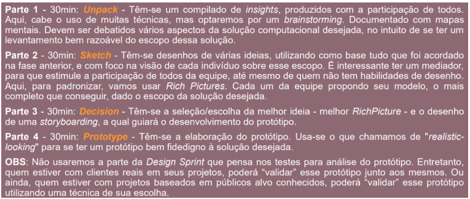
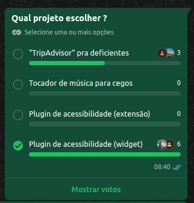

# 1.1. Módulo Design Sprint

## Introdução ao Design Sprint

O Design Sprint é uma metodologia estruturada, em etapas, para entender um problema, gerar soluções e testar rapidamente um protótipo com foco no usuário. Em um espaço curto de tempo, a equipe passa por momentos de entendimento do desafio, ideação, decisão e prototipagem, reduzindo incertezas antes do desenvolvimento completo de uma solução computacional.

## Metodologia adaptada para a disciplina

Para esta disciplina, adaptamos o Design Sprint proposto pela professora Milene Serrano, organizando o trabalho em cinco partes principais, com duração aproximada de 30 minutos cada:

- **Parte 1 – Unpack**: compilado de insights com participação de todos.
- **Parte 2 – Sketch**: geração e registro de diferentes ideias de solução.
- **Parte 3 – Decision**: seleção da melhor ideia e organização do fluxo.
- **Parte 4 – Prototype**: elaboração de um protótipo mais fiel à solução desejada.
- **Parte 5 – Test**: apresentação do protótipo para feedbacks e validação.

A figura utilizada em aula sintetiza essa adaptação do Design Sprint para a disciplina.

	

<em>Fonte: SERRANO, Milene.</em>

## Dia 1 – Unpack

**Parte 1 – Unpack.** Nesta etapa realizamos um compilado de insights sobre possíveis projetos, com a participação de todos os integrantes do grupo. Abrimos um documento [Word compartilhado](https://docs.google.com/document/d/1jjGzd4Pm8gnFpkDWV8VMIYfoFnyqslbroMfqNPf8awc/edit?usp=sharing) para que cada pessoa registrasse livremente suas ideias de solução. Em seguida, fizemos uma votação das opções (enquete no WhatsApp) e discutimos os resultados durante a aula de dúvidas, caracterizando um brainstorming coletivo.

	

<em>Figura – Enquete de votação do projeto.</em>

Como apoio, produzimos mapas mentais iniciais <i>(detalhados no Módulo Artefato Generalista, seção [Mapas Mentais](1.2.ArtefatoGeneralista.md#mapas-mentais))</i>, nos quais organizamos as primeiras propostas, seus objetivos e potenciais desdobramentos. Depois, transferimos e refinamos essas informações em um quadro colaborativo no Miro. O board pode ser acessado em: [Miro - Ideias Propostas](https://miro.com/app/board/uXjVGnre6pA=/?moveToWidget=3458764666330124860&cot=14).

	<iframe
		width="768"
		height="432"
		src="https://miro.com/app/live-embed/uXjVGnre6pA=/?moveToWidget=3458764666330124860&cot=14"
		frameborder="0"
		scrolling="no"
		allowfullscreen
	></iframe>

Ao final do Unpack, o grupo confirmou a sua decisão inicial feita pela votação em trabalhar no **plugin de acessibilidade (widget)**. A decisão considerou: a relevância do tema de acessibilidade digital, o alinhamento com o público que pretendemos apoiar, no qual não se concentra somente em um especifico, mas em todos aqueles que tem uma certa dificuldade em navegar na web, e o potencial de impacto em diferentes contextos de uso na Web. Essa definição de projeto, juntamente com os mapas mentais e o quadro no Miro, consolida o entendimento inicial do problema e serve de base para as próximas etapas do Design Sprint.

### Participação do grupo e atas de reunião

#### Quadro de contribuições

	<table style="margin: 0 auto;">
		<thead>
			<tr>
				<th>Nome</th>
				<th>Participação</th>
			</tr>
		</thead>
		<tbody>
			<tr><td>Felipe Brandim</td><td>Colaboração durante o brainstorming</td></tr>
			<tr><td>Dara Maria</td><td>Colaboração durante o brainstorming</td></tr>
			<tr><td>Enzo Fernandes</td><td>Colaboração durante o brainstorming</td></tr>
			<tr><td>Fábio Fonteles</td><td>Colaboração durante o brainstorming</td></tr>
			<tr><td>Fernanda Vaz</td><td>Colaboração durante o brainstorming</td></tr>
			<tr><td>Isaac Batista</td><td>Colaboração durante o brainstorming</td></tr>
			<tr><td>João Pedro</td><td>Colaboração durante o brainstorming</td></tr>
			<tr><td>Lucas Branco</td><td>Colaboração durante o brainstorming</td></tr>
			<tr><td>Matheus Rodrigues</td><td>Colaboração durante o brainstorming</td></tr>
			<tr><td>Pedro Cruz</td><td>Colaboração durante o brainstorming</td></tr>
		</tbody>
	</table>

#### Atas de reunião

As discussões realizadas durante o dia 1 da Design Sprint foram registradas em issues no repositório do projeto, com atas de reunião que detalham decisões e encaminhamentos:

- [Issue 3 – Ata de reunião](https://github.com/UnBArqDsw2026-1-Turma02/2026.01-T02_G4_AcessibilidadeJa_Entrega_01/issues/3)

## Histórico de versões

| Versão |    Data    | Descrição             |                  Autor(es)                   |
| :----: | :--------: | :-------------------- | :------------------------------------------: |
| `1.0`  | 31/03/2026 | Criação da página     | [Dara Maria](https://github.com/daramariabs) |
| `1.1`  | 02/04/2026 | Design Sprint - Dia 1 | [Enzo Fernandes](https://github.com/enzo-fb) |
