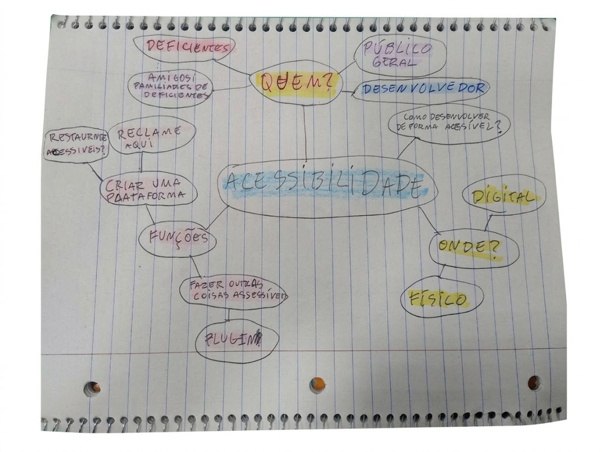
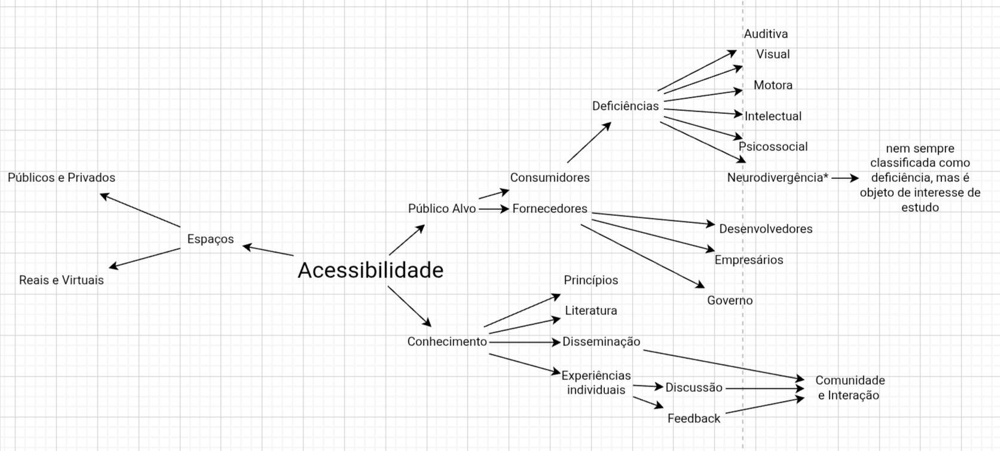
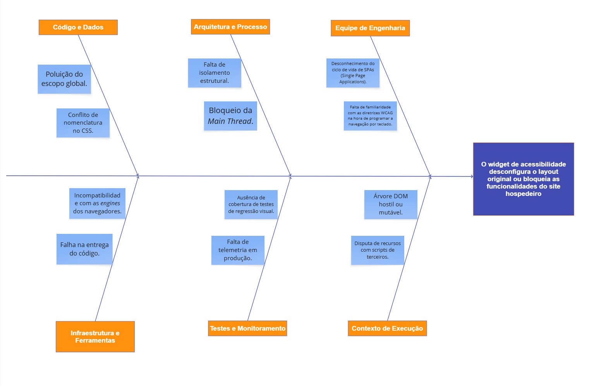
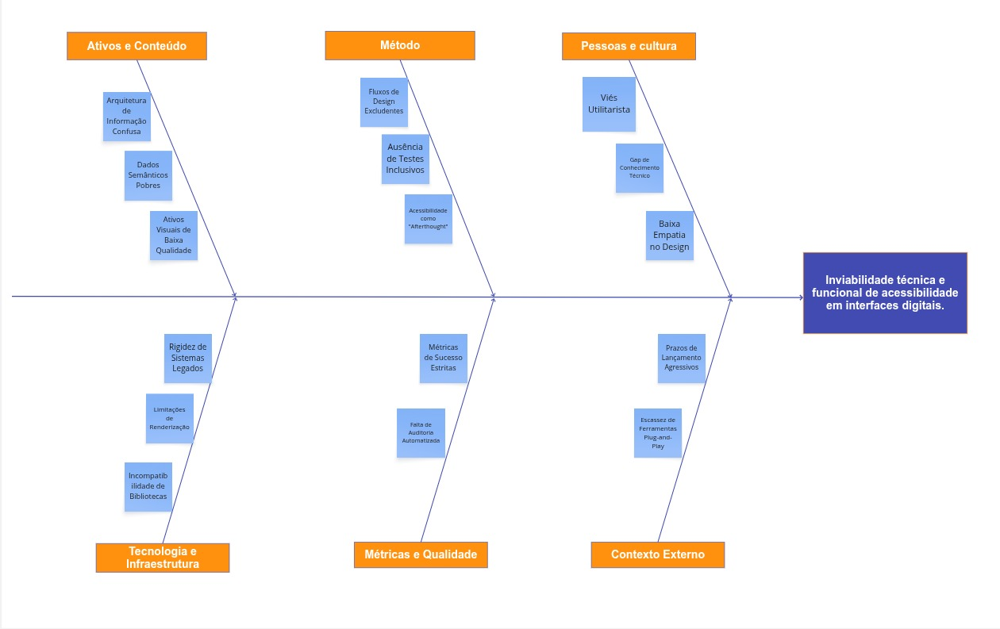
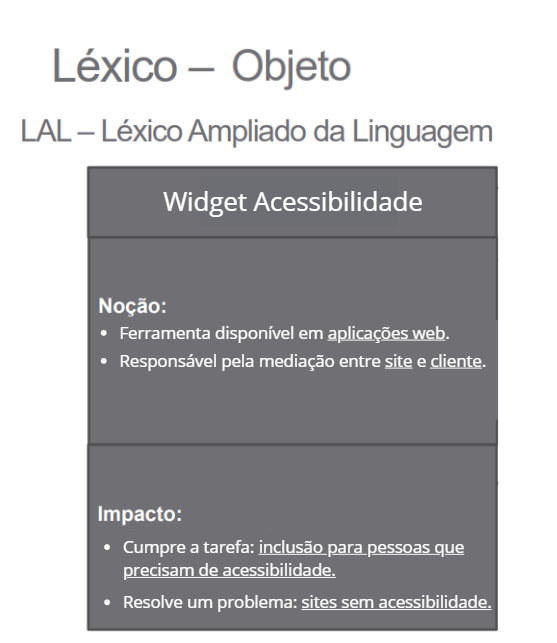

# 1.2. Módulo Artefato Generalista

## Mapas Mentais

As imagens abaixo mostram a evolução do pensamento do grupo sobre o tema acessibilidade. O primeiro mapa mental registra um momento inicial de brainstorming, com ideias mais abertas sobre público-alvo, contexto de uso e possíveis funcionalidades da solução. O segundo mapa representa um refinamento dessas ideias, com uma organização mais clara dos públicos envolvidos, dos tipos de deficiência considerados, dos espaços em que a acessibilidade se aplica e da importância da disseminação de conhecimento e da interação com a comunidade.

<i>Usamos como referência os slides da aula sobre artefato generalista. Eles nos ajudaram a estruturar nosso pensamento e a identificar as principais áreas de foco para o desenvolvimento de nossa solução.</i>

## Diagrama de Causa e Efeito (Ishikawa)

O Diagrama de Causa e Efeito, também conhecido como Diagrama de Ishikawa ou "Espinha de Peixe", é uma ferramenta visual de gestão da qualidade e análise de requisitos. No contexto da engenharia de software, ele permite estruturar um _brainstorming_ metódico para identificar as causas raízes de um problema complexo, indo além de seus sintomas superficiais.

Para o desenho base deste projeto, o diagrama foi construído utilizando a metodologia clássica dos **6Ms** (Máquina, Método, Material, Mão de Obra, Medida e Meio Ambiente). Essa categorização garante que todas as dimensões de risco sejam mapeadas de forma holística logo na Fase 1.

A análise do projeto foi dividida em duas perspectivas complementares para cobrir tanto as dores dos usuários quanto os desafios de engenharia:

## 1. Perspectiva de Arquitetura (Riscos Técnicos)

Nesta visão preventiva, o diagrama mapeia os possíveis gargalos e falhas de engenharia antes mesmo da codificação. O problema central definido é o maior risco técnico inerente à injeção de scripts em páginas de terceiros: _o widget desconfigurar o layout original ou bloquear as funcionalidades do site hospedeiro_.

#### Representação Visual do Diagrama

_Autores: [Dara Maria](https://github.com/daramariabs) e [Felipe Brandim](https://github.com/Felipe-Brandim)_

## 2. Perspectiva de Negócio (Dor do Usuário)

O problema central não é apenas a "baixa acessibilidade" de forma abstrata, mas a dificuldade técnica e financeira de implementar recursos inclusivos em sistemas novos ou legados. Atualmente, tornar um site acessível exige alto investimento em tempo, custo e conhecimento especializado, o que acaba gerando exclusão por omissão.

Nosso widget ataca justamente essa barreira de entrada. Ele funciona como uma camada de solução pronta que resolve os seguintes gargalos identificados no Diagrama de Ishikawa:

- Complexidade Técnica: Resolve a rigidez de códigos antigos sem precisar de refatoração.

- Déficit de Especialização: Dispensa a necessidade de um expert em acessibilidade no time.

- Agilidade: Transforma meses de ajuste em uma implementação de poucos minutos.

Em suma, a ferramenta traduz o conceito de **acessibilidade plug-and-play**, permitindo que o desenvolvedor escolha a inclusão sem sacrificar o cronograma do projeto.

#### Representação Visual do Diagrama

_Autores: [Dara Maria](https://github.com/daramariabs) e [Felipe Brandim](https://github.com/Felipe-Brandim)_

## Léxico

Léxico é uma técnica de engenharia de requisitos usada para descrever os símbolos (termos e expressões) de uma linguagem no contexto da aplicação estudada.
No modelo LAL (Léxico Ampliado da Linguagem), cada símbolo é definido por:

- Noção (denotação): o que o símbolo significa.

- Impacto (conotação): como esse símbolo afeta, é usado ou ocorre na aplicação.

Em resumo, o léxico ajuda a identificar e padronizar palavras-chave do domínio, facilitando o entendimento comum entre equipe e stakeholders.

_Autor: [Lucas Branco](https://github.com/lucasbbranco)_

## 5W2H

5W2H é um artefato que tem o objetivo de definir escopo e alinhar a equipe em objetivos e métodos. Este artefato foi feito em reunião baseado nas conversas feitas em sala de aula.

| What (o que?)                                                        | Why (por que?)                                                                                                                 | Who (quem?)                                                                                                                                                     | Where (onde?)             | When (quando?)                                                                                                                                                         | How (como?)                                                                                                             | How much (quanto custa?)                                                                                                                                                  |
| -------------------------------------------------------------------- | ------------------------------------------------------------------------------------------------------------------------------ | --------------------------------------------------------------------------------------------------------------------------------------------------------------- | ------------------------- | ---------------------------------------------------------------------------------------------------------------------------------------------------------------------- | ----------------------------------------------------------------------------------------------------------------------- | ------------------------------------------------------------------------------------------------------------------------------------------------------------------------- |
| Uma biblioteca de widgets com funcionalidades de acessibilidade web. | Porque pessoas têm dificuldade de acessar certos sites e desenvolvedores não têm capacidade e tempo para implementar sozinhos. | Público-alvo: desenvolvedores web. Cliente final: usuários web com dificuldades e necessidades especiais. Elaboradores: Grupo de Arquitetura de Software. | Para navegadores desktop. | Na etapa de desenvolvimento os desenvolvedores poderão adicionar a biblioteca de widgets. O cliente final poderá usar as funcionalidades ao utilizar o produto web. | Através de widgets, os desenvolvedores poderão adicionar funcionalidades de acessibilidade ao site de forma mais fácil. | O código será aberto e livre; para desenvolvedores e cliente final o custo será zero. O custo de desenvolvimento será um semestre letivo de comprometimento da equipe. |

---

## Rich Picture

Os Rich Pictures surgiram dentro da Soft Systems Methodology, criada por Peter Checkland, como uma forma de entender situações complexas. Em vez de usar só texto, usamos desenhos, símbolos e imagens para representar um problema. Isso ajuda porque muitas vezes pensamos melhor de forma visual e intuitiva do que apenas com palavras.

---

_Figura 3 – Rich Picture do Acessibilidade Já. Fonte: Fernanda Vaz (2026)._

## Histórico de versões

| Versão |    Data    | Descrição                                                                       |                      Autor(es)                      |
| :----: | :--------: | :------------------------------------------------------------------------------ | :-------------------------------------------------: |
| `1.0`  | 31/03/2026 | Criação da página                                                               |    [Dara Maria](https://github.com/daramariabs)     |
| `1.2`  | 31/03/2026 | Inserção do artefato generalista (mapas mentais)                                |    [Enzo Fernandes](https://github.com/enzo-fb)     |
| `1.3`  | 31/03/2026 | Inserção do artefato generalista (5w2h)                                         |       [Pedro Cruz](https://github.com/pfc15)        |
| `1.4`  | 01/04/2026 | Inserção do artefato generalista (Rich Picture )                                | [Fernanda Vaz](https://github.com/Fernandavazgit1)  |
| `1.5`  | 02/04/2026 | Inserção do artefato generalista (Diagrama de Ishikawa com foco na arquitetura) |    [Dara Maria](https://github.com/daramariabs)     |
| `1.6`  | 02/04/2026 | Inserção do artefato generalista (Diagrama de Ishikawa com foco no usuário)     | [Felipe Brandim](https://github.com/Felipe-Brandim) |
| `1.7`  | 02/04/2026 | Inserção do artefato generalista (Léxico)     | [Lucas Branco](https://github.com/lucasbbranco) |