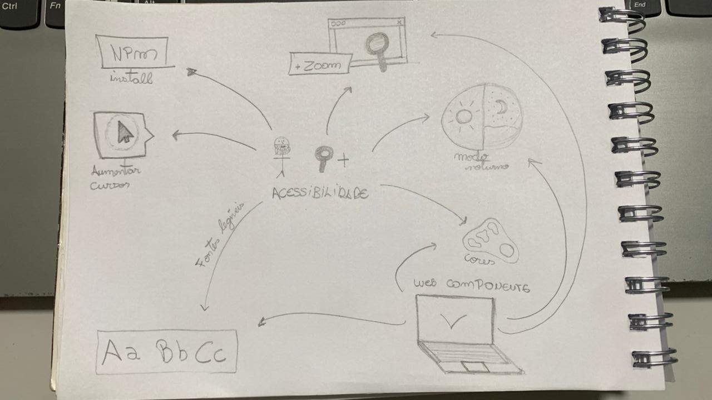
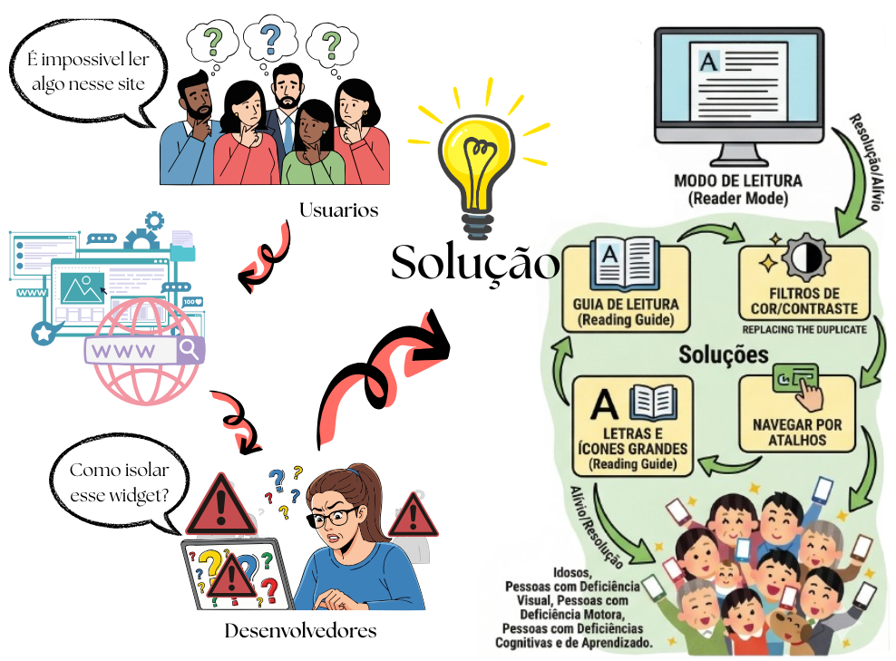
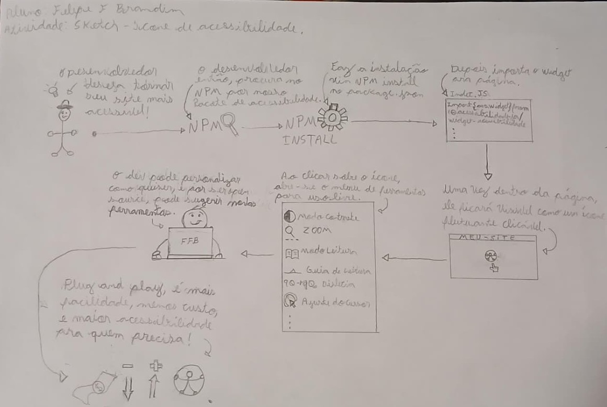
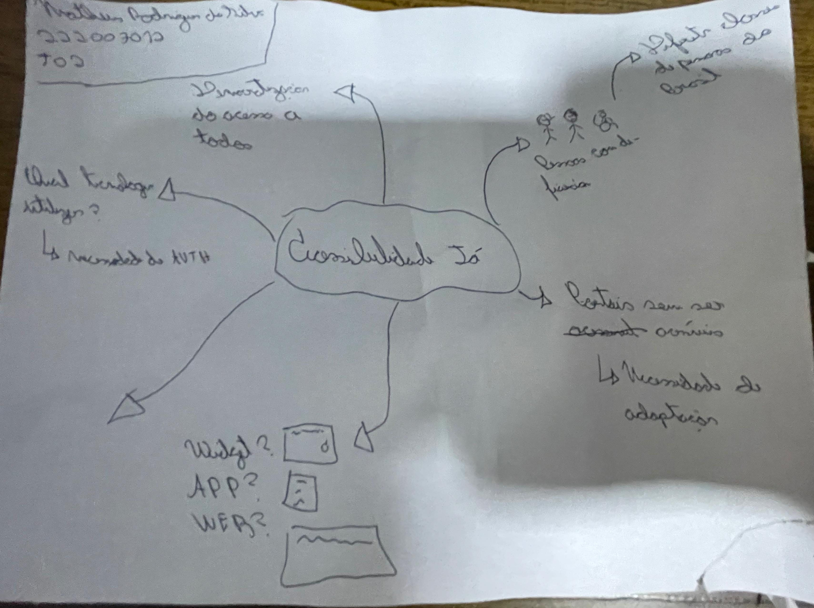

# 1.2. Módulo Artefato Generalista

## Mapas Mentais

As imagens abaixo mostram a evolução do pensamento do grupo sobre o tema acessibilidade. O primeiro mapa mental registra um momento inicial de brainstorming, com ideias mais abertas sobre público-alvo, contexto de uso e possíveis funcionalidades da solução. O segundo mapa representa um refinamento dessas ideias, com uma organização mais clara dos públicos envolvidos, dos tipos de deficiência considerados, dos espaços em que a acessibilidade se aplica e da importância da disseminação de conhecimento e da interação com a comunidade. O terceiro mostra um mapa mental específico sobre as possibilidades discutidas sobre o Web Component, detalhando suas funcionalidades.

_Autor: [Isaac Batista](https://github.com/isaacbatista26)_
<i>Usamos como referência os slides da aula sobre artefato generalista. Eles nos ajudaram a estruturar nosso pensamento e a identificar as principais áreas de foco para o desenvolvimento de nossa solução.</i>

## Diagrama de Causa e Efeito (Ishikawa)

O Diagrama de Causa e Efeito, também conhecido como Diagrama de Ishikawa ou "Espinha de Peixe", é uma ferramenta visual de gestão da qualidade e análise de requisitos. No contexto da engenharia de software, ele permite estruturar um _brainstorming_ metódico para identificar as causas raízes de um problema complexo, indo além de seus sintomas superficiais.

Para o desenho base deste projeto, o diagrama foi construído utilizando a metodologia clássica dos **6Ms** (Máquina, Método, Material, Mão de Obra, Medida e Meio Ambiente). Essa categorização garante que todas as dimensões de risco sejam mapeadas de forma holística logo na Fase 1.

A análise do projeto foi dividida em duas perspectivas complementares para cobrir tanto as dores dos usuários quanto os desafios de engenharia:

## 1. Perspectiva de Arquitetura (Riscos Técnicos)

Nesta visão preventiva, o diagrama mapeia os possíveis gargalos e falhas de engenharia antes mesmo da codificação. O problema central definido é o maior risco técnico inerente à injeção de scripts em páginas de terceiros: _o widget desconfigurar o layout original ou bloquear as funcionalidades do site hospedeiro_.

#### Representação Visual do Diagrama

_Autores: [Dara Maria](https://github.com/daramariabs) e [Felipe Brandim](https://github.com/Felipe-Brandim)_

## 2. Perspectiva de Negócio (Dor do Usuário)

O problema central não é apenas a "baixa acessibilidade" de forma abstrata, mas a dificuldade técnica e financeira de implementar recursos inclusivos em sistemas novos ou legados. Atualmente, tornar um site acessível exige alto investimento em tempo, custo e conhecimento especializado, o que acaba gerando exclusão por omissão.

Nosso widget ataca justamente essa barreira de entrada. Ele funciona como uma camada de solução pronta que resolve os seguintes gargalos identificados no Diagrama de Ishikawa:

- Complexidade Técnica: Resolve a rigidez de códigos antigos sem precisar de refatoração.

- Déficit de Especialização: Dispensa a necessidade de um expert em acessibilidade no time.

- Agilidade: Transforma meses de ajuste em uma implementação de poucos minutos.

Em suma, a ferramenta traduz o conceito de **acessibilidade plug-and-play**, permitindo que o desenvolvedor escolha a inclusão sem sacrificar o cronograma do projeto.

#### Representação Visual do Diagrama

_Autores: [Dara Maria](https://github.com/daramariabs) e [Felipe Brandim](https://github.com/Felipe-Brandim)_

## Léxico

Léxico é uma técnica de engenharia de requisitos usada para descrever os símbolos (termos e expressões) de uma linguagem no contexto da aplicação estudada.
No modelo LAL (Léxico Ampliado da Linguagem), cada símbolo é definido por:

- Noção (denotação): o que o símbolo significa.

- Impacto (conotação): como esse símbolo afeta, é usado ou ocorre na aplicação.

Em resumo, o léxico ajuda a identificar e padronizar palavras-chave do domínio, facilitando o entendimento comum entre equipe e stakeholders.

_Autor: [Lucas Branco](https://github.com/lucasbbranco)_

## 5W2H

5W2H é um artefato que tem o objetivo de definir escopo e alinhar a equipe em objetivos e métodos. Este artefato foi feito em reunião baseado nas conversas feitas em sala de aula.

| What (o que?)                                                        | Why (por que?)                                                                                                                 | Who (quem?)                                                                                                                                                     | Where (onde?)             | When (quando?)                                                                                                                                                         | How (como?)                                                                                                             | How much (quanto custa?)                                                                                                                                                  |
| -------------------------------------------------------------------- | ------------------------------------------------------------------------------------------------------------------------------ | --------------------------------------------------------------------------------------------------------------------------------------------------------------- | ------------------------- | ---------------------------------------------------------------------------------------------------------------------------------------------------------------------- | ----------------------------------------------------------------------------------------------------------------------- | ------------------------------------------------------------------------------------------------------------------------------------------------------------------------- |
| Uma biblioteca de widgets com funcionalidades de acessibilidade web. | Porque pessoas têm dificuldade de acessar certos sites e desenvolvedores não têm capacidade e tempo para implementar sozinhos. | Público-alvo: desenvolvedores web. Cliente final: usuários web com dificuldades e necessidades especiais. Elaboradores: Grupo de Arquitetura de Software. | Para navegadores desktop. | Na etapa de desenvolvimento os desenvolvedores poderão adicionar a biblioteca de widgets. O cliente final poderá usar as funcionalidades ao utilizar o produto web. | Através de widgets, os desenvolvedores poderão adicionar funcionalidades de acessibilidade ao site de forma mais fácil. | O código será aberto e livre; para desenvolvedores e cliente final o custo será zero. O custo de desenvolvimento será um semestre letivo de comprometimento da equipe. |

---

## Rich Picture

Os Rich Pictures surgiram dentro da Soft Systems Methodology, criada por Peter Checkland, como uma forma de entender situações complexas. Em vez de usar só texto, usamos desenhos, símbolos e imagens para representar um problema. Isso ajuda porque muitas vezes pensamos melhor de forma visual e intuitiva do que apenas com palavras.

Durante a Design Sprint, o grupo desenvolveu Rich Pictures para representar o cenário do problema. Reunimos abaixo essas ilustrações, que integram elementos comuns à equipe e interpretações individuais dos participantes.

---

_Figura 01 - Autor: [Fernanda Vaz](https://github.com/Fernandavazgit1)_

_Figura 02 - Autor: [Dara Maria](https://github.com/daramariabs)_

_Figura 03 - Membro: [Felipe Brandim](https://github.com/Felipe-Brandim)_

_Figura 04 - Membro: [Matheus Rodrigues](https://github.com/mrodrigues14)_

# Glossário 

## Introdução

O **Glossário** é um artefato essencial em projetos de desenvolvimento de software, especialmente quando envolvem equipes multidisciplinares. Ele tem como objetivo padronizar e esclarecer os termos técnicos, ferramentas, metodologias e conceitos utilizados ao longo do projeto, garantindo um entendimento comum entre todos os participantes.

Neste documento, são apresentados os principais termos empregados no contexto do projeto **AcessibilidadeJá**, com definições claras e concisas, de modo a facilitar a comunicação, reduzir ambiguidades e contribuir para a qualidade e consistência da documentação.

## Metodologia

A construção do **Glossário** foi realizada por meio de um processo colaborativo entre membros da equipe do projeto. Inicialmente, foi feito um levantamento dos principais termos técnicos, metodológicos e conceituais utilizados nos encontros, artefatos e demais documentos do projeto. Após a elaboração das definições, as informações foram revisadas coletivamente para garantir clareza, coerência e adequação ao contexto do projeto. Por fim, o glossário foi estruturado em formato de tabela para facilitar a consulta e será atualizado sempre que necessário, conforme o surgimento de novos termos ou mudanças no escopo do trabalho.

## Glossário

A **Tabela 1** possui os principais termos, acompanhados de suas respectivas definições.

<b>Tabela 1:</b> Glossário

| Termo | Definição |
|-------|-----------|
| **Acessibilidade Web** | Conjunto de práticas e diretrizes que garantem que sites e aplicações digitais possam ser utilizados por pessoas com diferentes tipos de deficiência ou necessidades especiais |
| **Artefatos** | Elementos concretos produzidos durante o desenvolvimento de software, como documentos, diagramas e códigos |
| **BPMN** | Notação padrão para modelagem de processos de negócio usando símbolos gráficos (tarefas, eventos, gateways) |
| **Design Sprint** | Metodologia ágil que combina ideação, prototipagem e validação em ciclos curtos para resolver problemas de design rapidamente |
| **Diagrama Causa-Efeito (Ishikawa)** | Representação visual em forma de espinha de peixe que mapeia possíveis causas de um problema em categorias como Máquina, Método, Material, Mão de Obra, Medida e Meio Ambiente |
| **Figma** | Ferramenta de design colaborativo baseada em nuvem utilizada para criação de protótipos de interfaces digitais |
| **5W2H** | Ferramenta de gestão baseada em 7 questionamentos (What, Why, Who, Where, When, How e How much) para estruturar e alinhar equipes em objetivos e métodos |
| **Léxico (LAL)** | Técnica de engenharia de requisitos que descreve os termos e expressões de um domínio por meio de noção (o que significa) e impacto (como afeta o sistema) |
| **Mapa Mental** | Diagrama hierárquico que organiza ideias a partir de um conceito central de forma radial, utilizado para brainstorming e estruturação do pensamento |
| **Protótipo** | Versão inicial funcional criada para testes e validação de conceitos antes da implementação final do produto |
| **Rich Picture** | Ilustração informal que representa elementos, atores e relações em sistemas complexos sem notação rígida, favorecendo a compreensão do problema |
| **TDD (Test-Driven Development)** | Prática de desenvolvimento em que os testes são escritos antes do código de produção, guiando a implementação e garantindo a qualidade do software |
| **Usabilidade** | Medida de quão fácil, eficiente e satisfatório é o uso de uma interface ou sistema por seus usuários |
| **Validação de Protótipo** | Etapa do desenvolvimento em que um protótipo é apresentado a usuários ou especialistas para verificar se atende às necessidades antes da implementação final |
| **Widget** | Componente de interface gráfica reutilizável que pode ser incorporado em diferentes páginas ou sistemas para adicionar funcionalidades específicas |
| **XP (Extreme Programming)** | Metodologia ágil de desenvolvimento de software focada em qualidade técnica, com práticas como TDD, programação em pares e entregas frequentes |

<b>Autor:</b> <a href="https://github.com/fabiofonteles1">Fábio Araújo</a>, 2026.

## Bibliografia

> METTZER. Glossário: principais termos acadêmicos explicados. Blog Mettzer, 2021. Disponível em: https://blog.mettzer.com/glossario/. Acesso em: 03 abr. 2026.

> W3C. Web Content Accessibility Guidelines (WCAG). Disponível em: https://www.w3.org/WAI/standards-guidelines/wcag/. Acesso em: 03 abr. 2026.

## Histórico de versões

| Versão |    Data    | Descrição                                                                       |                      Autor(es)                      |
| :----: | :--------: | :------------------------------------------------------------------------------ | :-------------------------------------------------: |
| `1.0`  | 31/03/2026 | Criação da página                                                               |    [Dara Maria](https://github.com/daramariabs)     |
| `1.2`  | 31/03/2026 | Inserção do artefato generalista (mapas mentais)                                |    [Enzo Fernandes](https://github.com/enzo-fb)     |
| `1.3`  | 31/03/2026 | Inserção do artefato generalista (5w2h)                                         |       [Pedro Cruz](https://github.com/pfc15)        |
| `1.4`  | 01/04/2026 | Inserção do artefato generalista (Rich Picture )                                | [Fernanda Vaz](https://github.com/Fernandavazgit1)  |
| `1.5`  | 02/04/2026 | Inserção do artefato generalista (Diagrama de Ishikawa com foco na arquitetura) |    [Dara Maria](https://github.com/daramariabs)     |
| `1.6`  | 02/04/2026 | Inserção do artefato generalista (Diagrama de Ishikawa com foco no usuário)     | [Felipe Brandim](https://github.com/Felipe-Brandim) |
| `1.7`  | 02/04/2026 | Inserção do artefato generalista (Léxico)     | [Lucas Branco](https://github.com/lucasbbranco) |
| `1.8`  | 03/04/2026 | Inserção do artefato generalista (Rich Picture - Figura 02) |    [Dara Maria](https://github.com/daramariabs)     |
| `1.9`  | 03/04/2026 | Inserção do artefato generalista (Rich Picture - Figura 03)     | [Felipe Brandim](https://github.com/)
| `2.0`  | 04/04/2026 | Criação do glossário    | [Fábio Araújo](https://github.com/fabiofonteles1)      |
| `2.1`  | 05/04/2026 | Inserção do artefato generalista (Mapa Mental)    | [Isaac Batista](https://github.com/isaacbatista26)      |
| `2.2`  | 05/04/2026 | Inserção do artefato generalista (Rich Picture - Figura 04) | [Matheus Rodrigues](https://github.com/mrodrigues14) |