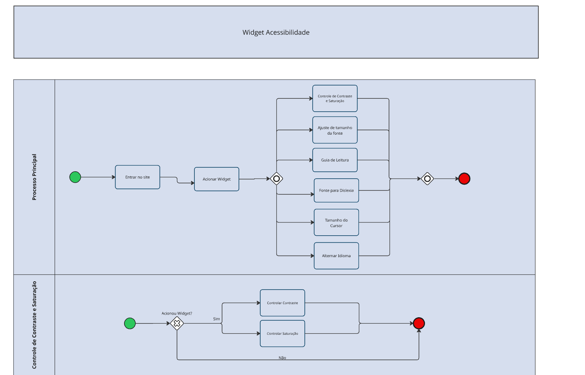
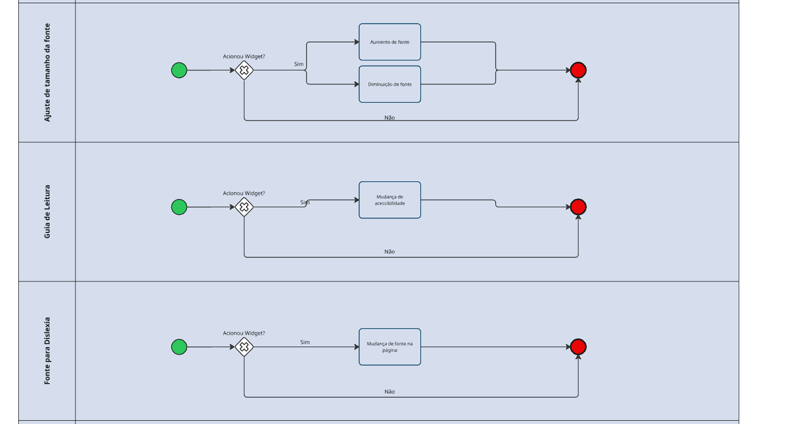
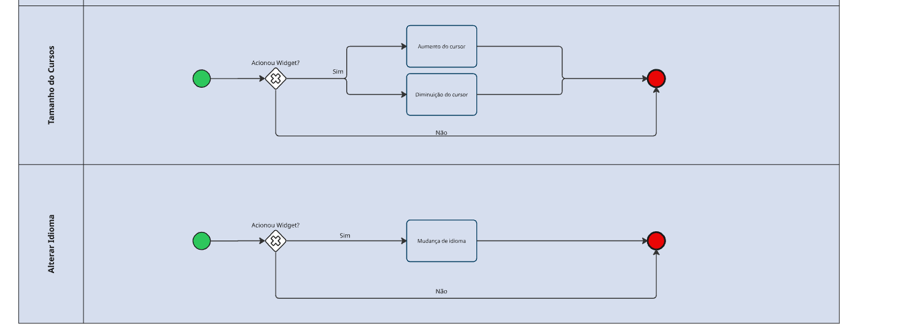
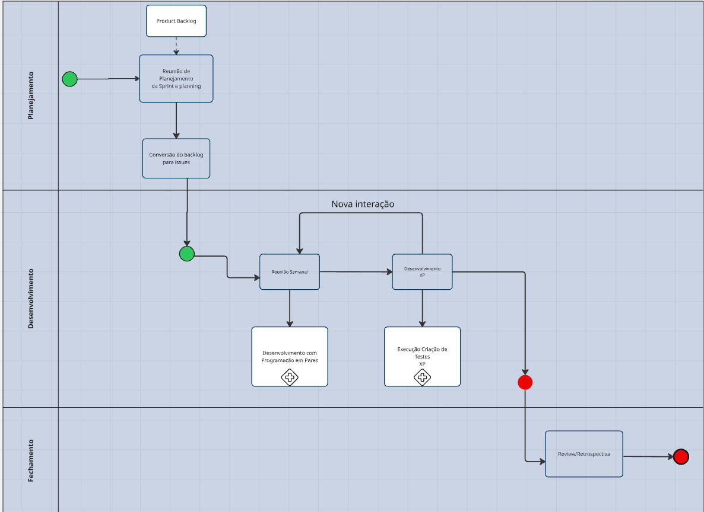
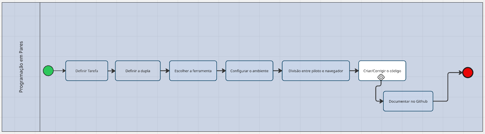
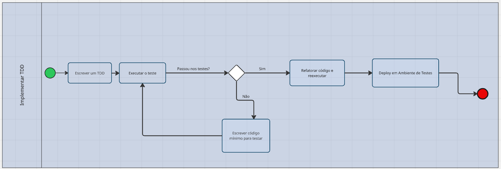

# 1.3. Módulo Modelagem BPMN

## Sobre

O BPMN (Business Process Model and Notation) é uma notação gráfica usada para representar processos de negócio de forma clara, organizada e padronizada. Ele emprega símbolos, fluxos e elementos específicos para descrever, analisar e aprimorar as etapas de um processo, facilitando o entendimento por diferentes perfis, como desenvolvedores, analistas e gestores.

Sua estrutura possibilita visualizar de forma sequencial atividades, decisões, eventos e interações entre os participantes, o que ajuda a identificar gargalos, redundâncias e pontos de melhoria. Além disso, o BPMN contribui para a padronização da comunicação entre equipes, já que utiliza uma linguagem visual amplamente reconhecida e de fácil interpretação.

Trata-se de uma ferramenta importante para o planejamento, registro e gestão de processos, permitindo que todos os envolvidos tenham uma visão clara e compartilhada das operações. Também favorece a colaboração e a tomada de decisões, ao transformar fluxos complexos em diagramas mais simples e intuitivos.

## Modelagens BPMN que foram desenvolvidas

- Scrum/XP: Modelará o processo iterativo do Scrum/XP, incluindo backlog, planejamento de sprint, execução, revisão e retrospectiva.
- Software AcessibilidadeJá: Mostrará o fluxo de funcionamento do software, destacando as etapas principais de interação e os papéis envolvidos.

## Participantes da Modelagem BPMN

Os participantes da elaboração de todos os BPMNs estão descritos na Tabela abaixo, todas as modelagens foram feitas em reunião e em conjunto.

| Matrícula | Aluno |
| :---: | :--- |
| 202046040 | Dara Maria |
| 202017361 | Enzo Fernandes |
| 222022082 | Fabio Santos |
| 202016201 | Felipe Brandim |
| 221007715 | Fernanda Vaz |
| 222006946 | Lucas Branco |
| 222007012 | Matheus Rodrigues |
| 212005444 | Pedro Cruz |

## Diagrama BPMN - Modelagem do Software

## Diagrama BPMN - Metodologia Escolhida (Scrum/XP)

## Histórico de versões

| Versão | Data | Descrição | Autor(es) |
| :---: | :---: | :--- | :---: |
| `1.0` | 31/03/2026 | Criação da página | [Dara Maria](https://github.com/daramariabs) |
| `1.1` | 03/04/2026 | Preenchimento da página | [Lucas Branco](https://github.com/lucasbbranco) |